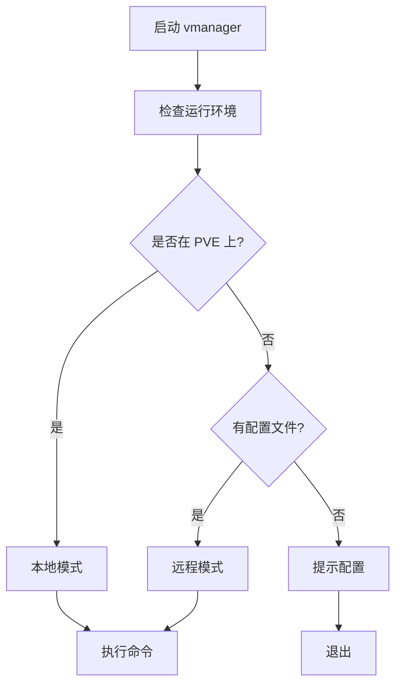

# vmanager v3.0

[](https://www.gnu.org/licenses/gpl-3.0)
[](https://github.com/sscaifesu/vmanager)

Proxmox 虚拟机管理工具

## 新特性（v3.0）

- **智能检测**：自动识别运行环境（本地/远程）
- **统一体验**：一个命令，适用所有场景
- **无缝切换**：本地和远程模式自动切换
- **跨平台**：支持 macOS、Linux、Windows

## 特性

### 核心功能

- **智能模式检测**：自动识别 PVE 环境
- **本地模式**：在 PVE 服务器上直接使用 qm 命令
- **远程模式**：通过 Proxmox API 远程管理
- **批量操作**：支持单个、多个和范围 VMID
- **完整功能**：start/stop/restart/suspend/resume/destroy/status/list
- **配置管理**：简单的配置向导

### 运行模式

| 模式 | 说明 | 使用场景 |
|------|------|----------|
| **本地模式** | 直接使用 qm 命令 | 在 PVE 服务器上运行 |
| **远程模式** | 使用 Proxmox API | 在任何平台上远程管理 |
| **自动模式** | 智能检测并选择 | 默认模式（推荐） |

## 快速开始

### 安装

#### 方法 1: 从源代码编译

```bash
# 克隆仓库
git clone https://github.com/sscaifesu/vmanager.git
cd vmanager/v3

# 编译
gcc -Wall -Wextra -O2 -std=c11 -o vmanager vmanager.c

# 安装
sudo install -m 755 vmanager /usr/local/bin/vmanager
```

#### 方法 2: 使用预编译二进制

从 [Releases](https://github.com/sscaifesu/vmanager/releases) 下载对应平台的文件。

### 使用

#### 场景 1: 在 PVE 服务器上使用（本地模式）

```bash
# 自动检测到 PVE 环境，使用本地模式
vmanager list
vmanager start 100
vmanager stop 100-110
```

#### 场景 2: 在其他平台上远程管理（远程模式）

```bash
# 首次使用，配置远程连接
vmanager --config

# 输入 PVE 服务器信息
# - 主机地址: 192.168.1.100
# - 端口: 8006
# - 节点名称: pve
# - 认证方式: API Token（推荐）

# 配置完成后，正常使用
vmanager list
vmanager start 100
```

## 使用方法

### 基本语法

```
vmanager [OPTIONS] COMMAND [VMID...]
```

### 命令

| 命令 | 说明 |
|------|------|
| `start` | 启动虚拟机 |
| `stop` | 停止虚拟机 |
| `restart` | 重启虚拟机 |
| `suspend` | 暂停虚拟机 |
| `resume` | 恢复虚拟机 |
| `destroy` | 销毁虚拟机 |
| `status` | 查看虚拟机状态 |
| `list` | 列出所有虚拟机 |

### 选项

| 选项 | 说明 |
|------|------|
| `-h, --help` | 显示帮助信息 |
| `-V, --version` | 显示版本信息 |
| `-c, --config` | 配置远程连接 |
| `-f, --force` | 强制执行（跳过确认） |
| `-q, --quiet` | 静默模式 |
| `-m, --mode` | 指定模式 (auto/local/remote) |

### 示例

#### 基本操作

```bash
# 查看所有 VM
vmanager list

# 启动 VM
vmanager start 100

# 停止 VM
vmanager stop 100

# 重启 VM
vmanager restart 100
```

#### 批量操作

```bash
# 启动多个 VM
vmanager start 100 101 102

# 停止范围内的 VM
vmanager stop 100-110

# 混合使用
vmanager start 100 105-110 115
```

#### 高级功能

```bash
# 暂停 VM
vmanager suspend 100

# 恢复 VM
vmanager resume 100

# 销毁 VM（需要确认）
vmanager destroy 100

# 强制销毁（跳过确认）
vmanager destroy -f 100

# 查看 VM 状态
vmanager status 100
```

#### 模式控制

```bash
# 自动模式（默认）
vmanager list

# 强制使用本地模式
vmanager --mode=local list

# 强制使用远程模式
vmanager --mode=remote list
```

## 配置

### 配置文件位置

- Linux/macOS: `~/.vmanager.conf`
- Windows: `%USERPROFILE%\.vmanager.conf`

### 配置向导

```bash
vmanager --config
```

按提示输入：
1. Proxmox 主机地址
2. 端口（默认 8006）
3. 节点名称
4. 用户名
5. 认证方式（推荐 API Token）
6. SSL 验证选项

### 配置文件格式

```ini
# vmanager 配置文件
host=192.168.1.100
port=8006
user=root@pam
node=pve
verify_ssl=0

# API Token 认证（推荐）
token_id=root@pam!vmanager
token_secret=xxxxxxxx-xxxx-xxxx-xxxx-xxxxxxxxxxxx
```

### 创建 API Token

1. 登录 Proxmox Web 界面
2. Datacenter → Permissions → API Tokens
3. Add → 填写信息
4. 保存 Token Secret（只显示一次）

### 配置 Token 权限（重要）

**注意**: API Token 默认不继承用户权限，必须显式分配权限。

#### 方法 1: 命令行（推荐）

```bash
# 为 Token 添加审计权限（只读，推荐）
pveum acl modify / -token 'root@pam!vmanager' -role PVEAuditor

# 或者添加 VM 管理权限（读写）
pveum acl modify / -token 'root@pam!vmanager' -role PVEVMAdmin
```

#### 方法 2: Web 界面

1. Datacenter → Permissions → Add → API Token Permission
2. 填写信息：
   - **Path**: `/`
   - **API Token**: 选择你的 Token
   - **Role**: `PVEAuditor`（只读）或 `PVEVMAdmin`（读写）
   - **Propagate**: 勾选

#### 权限角色说明

| 角色 | 权限 | 适用场景 |
|------|------|----------|
| PVEAuditor | 只读，可查看所有资源 | vmanager list, status（推荐）|
| PVEVMAdmin | 读写，可管理 VM | vmanager start, stop, restart |

#### 验证权限

```bash
# 测试 API 是否返回数据
curl -s -k 'https://YOUR_HOST:8006/api2/json/nodes/YOUR_NODE/qemu' \
  -H 'Authorization: PVEAPIToken=USER!TOKEN=SECRET'

# 应该返回 VM 列表，而不是 {"data":[]}
```

## 工作原理

### 环境检测流程



### 本地模式

- 检测到 `/usr/sbin/qm` 和 `/etc/pve`
- 直接使用 `qm` 命令
- 性能最优
- 需要 root 权限

### 远程模式

- 未检测到 PVE 环境
- 使用 Proxmox API
- 支持跨平台
- 需要配置文件

## 版本对比

| 特性 | v2.0 | v3.0 |
|------|------|------|
| 本地管理 | ✓ | ✓ |
| 远程管理 | ✗ | ✓ |
| 智能检测 | ✗ | ✓ |
| 统一命令 | ✗ | ✓ |
| 配置管理 | ✗ | ✓ |
| 跨平台 | Linux | macOS/Linux/Windows |

## 故障排查

### 问题 1: 提示未检测到 PVE 环境

```bash
# 检查是否在 PVE 服务器上
ls /usr/sbin/qm
ls /etc/pve

# 如果不在 PVE 上，配置远程连接
vmanager --config
```

### 问题 2: 远程连接失败

```bash
# 检查配置文件
cat ~/.vmanager.conf

# 测试连接
curl -k https://PVE_HOST:8006/api2/json/version

# 重新配置
vmanager --config
```

### 问题 3: 权限错误

```bash
# 本地模式需要 root 权限
sudo vmanager list

# 远程模式不需要 root
vmanager list
```

## 性能对比

| 模式 | 启动时间 | 内存占用 | 网络延迟 |
|------|----------|----------|----------|
| 本地模式 | ~1ms | ~0.5MB | 无 |
| 远程模式 | ~50ms | ~1MB | 取决于网络 |

## 安全建议

1. **使用 API Token** - 不要使用密码认证
2. **限制权限** - 为 Token 设置最小权限
3. **保护配置文件** - 设置适当的文件权限
   ```bash
   chmod 600 ~/.vmanager.conf
   ```
4. **使用 SSL** - 在生产环境中启用 SSL 验证
5. **定期轮换** - 定期更换 API Token

## 开发计划

### v3.1
- [ ] 多服务器配置支持
- [ ] 环境变量配置
- [ ] 调试模式
- [ ] 性能优化

### v4.0
- [ ] TUI 界面
- [ ] Web 界面
- [ ] 移动应用
- [ ] 集群管理

## 贡献

欢迎提交 Issue 和 Pull Request！

## 许可证

GNU General Public License v3.0

## 作者

**YXWA Infosec Lab**
- Crystal
- evalEvil

## 链接

- 项目主页: https://github.com/sscaifesu/vmanager
- 问题反馈: https://github.com/sscaifesu/vmanager/issues
- Proxmox API: https://pve.proxmox.com/pve-docs/api-viewer/

---

**版本**: 3.0.0  
**发布日期**: 2025-10-05  
**状态**: 稳定版本
